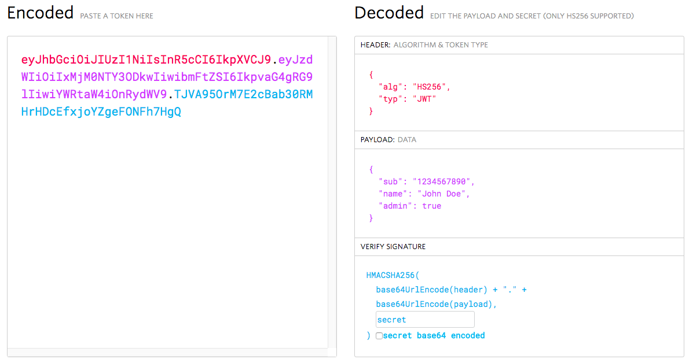

# JWT (Jason Web Tokens)

**JWT 是什麼？**

> JSON Web Token (JWT) is a compact URL-safe means of representing claims to be transferred between two parties. The claims in a JWT are encoded as a JSON object that is digitally signed using JSON Web Signature (JWS).
- RFC7519 https://tools.ietf.org/html/rfc7519

JWT 是一種安全標準，基本就是 client 提供帳號和密碼給認證 server，server 驗證成功，會產生一個 Token 塞在 Response 中，client 可以使用這個 Token 存取 Server 上的資源(資料)。

> The suggested pronunciation of JWT is the same as the English word
"jot".



**問題**

* 基本認證 vs. JWT 差在哪？
* 在沒有 JWT 前的做法是？

**結構可分為三個部分**

* 表頭 (Headers)
* 附加資料 (Claims / Payload)
* 簽證 (Signature)

**優點**

* JSON 格式通用性高
* payload 機制可以附帶一些非敏感訊息的資料
* token 佔的空間很小，容易傳輸。
* 因為不是 Session 的機制，不會有 load balancer 的瓶頸。

**缺點**

* Token 有長度限制

**使用情境**

* 任何需要 Token 機制的地方
* 無狀態的分散式 API

**實作**

* 選用 Library
* 設定 CORS

```
Access-Control-Allow-Origin: *
```

```
Authorization: Bearer <token>
```
**注意事項**

* 保護好私鑰
* 盡量使用 https 傳遞資料
* 不要將敏感訊息附加在 payload 中

**JWT vs. OAuth 2.0**

* JWT 是一種認證協議，OAuth2 是一種授權框架(提供了一套詳細的授權機制)。

問題：認證 vs. 授權

**延伸閱讀**

* [JSON Web Token - Wikipedia](https://en.wikipedia.org/wiki/JSON_Web_Token)
* [JSON Web Tokens - jwt.io](https://jwt.io/)
