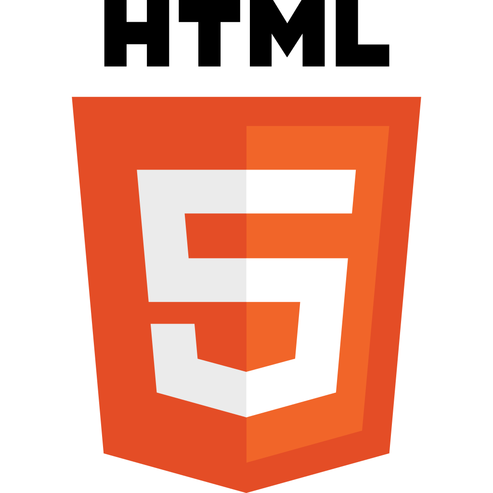

# HTML5 基礎入門

**什麼是HTML5**

`HTML5` 是 HTML 新版的修訂版本，由 W3C、WHATWG 完成標準制定，目標是取代1999年所製定的 HTML 4.01 和 XHTML 1.0 標準，期望能符合現在的網路需求。

**HTML5的特色**

* 支援本機儲存
* 支援 CSS3
* 更多的表單元素：url, email
* 更多的新的元素：nav, footer
* 更多的多媒體支援 video, svg, canvas
* 有更佳的容錯性，例如自動補上缺少的必要標籤，使用者可避免看到網站撰寫的錯誤。

**與HTML 4的不同之處**

* 檔案類型聲明（<!DOCTYPE>）僅有一型：<!DOCTYPE HTML>。
* 新的解析順序：不再基於SGML。
* 新的元素：section, video, progress, nav, meter, time, aside, canvas, command, datalist, details, embed, figcaption, figure, footer, header, hgroup, keygen, mark, output, rp, rt, ruby, source, summary, wbr。
input元素的新類型：date, email, url等等。
* 新的屬性：ping（用於a與area）, charset（用於meta）, async（用於script）。
* 全域屬性：id, tabindex, repeat。
* 新的全域屬性：contenteditable, contextmenu, draggable, dropzone, hidden, spellcheck。
* 移除元素：acronym, applet, basefont, big, center, dir, font, frame, frameset, isindex, noframes, strike, tt。

**延伸閱讀**

* [w3school en html5](http://www.w3schools.com/html/html5_intro.asp)
* [wiki html5](https://zh.wikipedia.org/wiki/HTML5)
