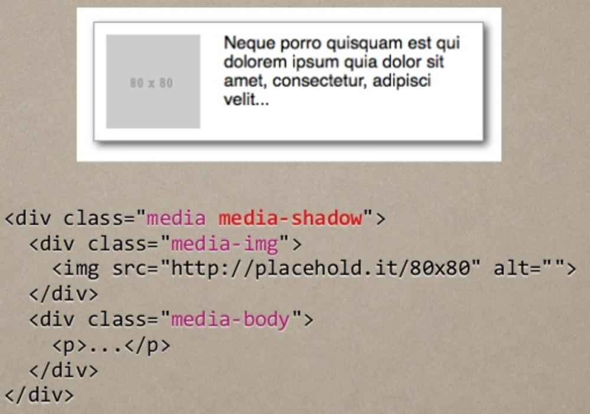
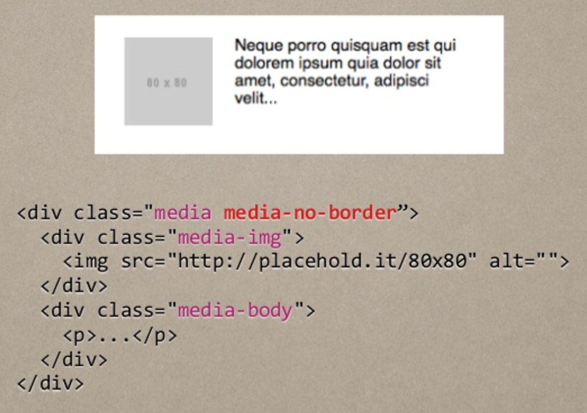

# 物件導向 CSS

## 程式語言中的物件導向

* 邏輯與結構抽離
* 提高維護性
* class & instance

```js
var Person = function (firstName) {
  this.firstName = firstName;
};

Person.prototype.sayHello = function() {
  console.log("Hello, I'm " + this.firstName);
};

var person1 = new Person("Alice");
var person2 = new Person("Bob");

// 呼叫 Person sayHello 方法。
person1.sayHello(); // "Hello, I'm Alice"
person2.sayHello(); // "Hello, I'm Bob"
```

資料來源：[JavaScript 物件導向介紹 - JavaScript | MDN](https://developer.mozilla.org/zh-TW/docs/Web/JavaScript/Introduction_to_Object-Oriented_JavaScript)

## CSS 架構

### OOCSS兩大原則

```html
<a class="button button-default">
<a class="button button-primary">
```

* 結構與外觀分離
  * 結構
    * media
    * media-img
    * media-body
  * 外觀
    * media-no-border
    * media-shadow
* 容器與內容分離

**基本結構**


**粗框**



**無框**



> 資料來源：[漫談 CSS 架構方法 - 以 OOCSS, SMACSS, BEM 為例](http://www.slideshare.net/kurotanshi/css-oocss-smacss-bem)

### SMACSS

```
scss/
|- _base/
|  |- _config.scss
|  |- _presets.scss
|  |- _headings.scss
|  |- ...

|- _layouts/
|  |- _l-base.scss
|  |- _l-grid.scss

|- _modules/
|  |- _m-buttons.scss
|  |- _m-tabs.scss

|- _states/
|  |- _s-buttons.scss
|  |- _s-tabs.scss
|- application.scss

stylesheets/
|- application.css
```

**Base**

```css
body, form {
    margin: 0;
    padding: 0;
}

a {
    color: #039;
}

a:hover {
    color: #03F;    
}
```

* CSS Resets

**Layout**

```
#header, #article, #footer {
    width: 960px;
    margin: auto;
}

#article {
    border: solid #CCC;
    border-width: 1px 0 0;
}
```

**Module / Component**

**State**

```
.tab {
    background-color: purple;
    color: white;
}

.is-tab-active {
    background-color: white;
    color: black;
}
```

**Theme**

```
// in module-name.css
.mod {
    border: 1px solid;
}

// in theme.css
.mod {
    border-color: blue;
}
```

> 資料來源：[Home - Scalable and Modular Architecture for CSS](https://smacss.com/)

### BEM

* Block: e.g. header, container, menu, checkbox, input
* Element: e.g. menu item, list item, checkbox caption, header title
* Modifier
  * e.g. disabled, highlighted, checked, fixed, size big, color yellow
  * 與 SMACSS 的 state rule 相似

**語法**

```
block__element
element--modifier
```

**範例**

```
menu__item
tab--active
```

> 資料來源：[BEM — Block Element Modifier](http://getbem.com/introduction/)

## 活用學到的 CSS pattern 設計下方圖片的 CSS


### OOCSS 

* 結構
    * module：modal, button
    * sub module：modal-header, modal-content, modal-footer
* 外觀：
    * button-primary
* 容器
    * container, container-fluid

### SMACSS

```
scss/
|- _base/
|  |- _variables.scss
|  |- _presets.scss
|  |- _headings.scss
|  |- ...

|- _layouts/
|  |- _l-base.scss
|  |- _l-grid.scss

|- _modules/
|  |- _m-buttons.scss
|  |- _m-modals.scss

|- _states/
|  |- _s-buttons.scss
|- app.scss

css/
|- app.css
```

### BEM

* B
    * modal
    * button
* E
    * modal__button
    * modal__header
    * modal__content
    * modal__footer
* M
    * button--hover
    * button--lg, button--md, button--sm, button--xs

### 延伸閱讀

* [漫談 CSS 架構方法 - 以 OOCSS, SMACSS, BEM 為例](http://www.slideshare.net/kurotanshi/css-oocss-smacss-bem)
* [Pure CSS framework](https://purecss.io/)：只有 CSS，沒有含 JS。
* [劣以為的 OOCSS 和 SMACSS 以及其他 CSS 規範 - @ChingHanHo](http://blog.chh.tw/posts/oocss-smacss-and-css-guidelines/)
* [如何逐步提升CSS的可利用性、模組化](http://www.slideshare.net/sfismy/css-21022273)
* [Scss-Styleguide with BEM, OOCSS & SMACSS - Tim Hartmann](http://timhartmann.net/frontend-development/scss-styleguide-with-bem-oocss-smacss/)